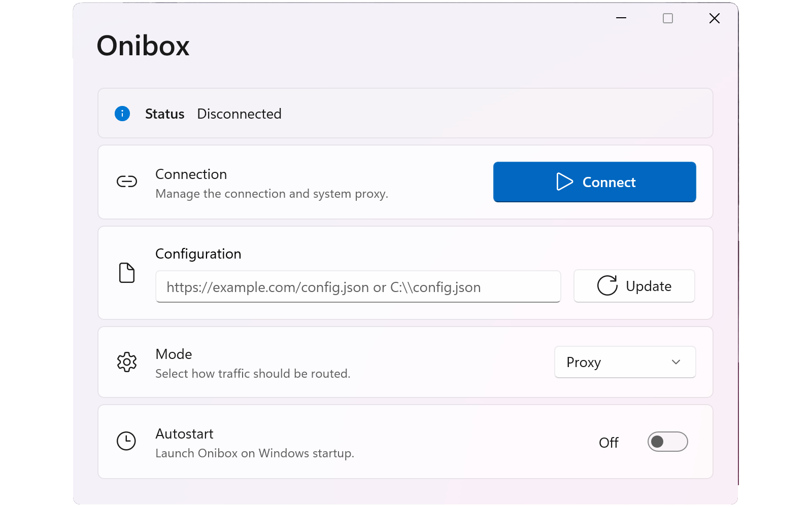

# Onibox for Windows

[Русская версия](README.ru.md)

GUI wrapper for `sing-box` built with WinUI 3.



## Motivation

Available clients either lacked required features or had overloaded interfaces.
I needed a simple and clear client that even non-technical users could use.

## Usage Scenario

1. Host a full `sing-box` config (for example, on your web server or on GitHub).
2. Provide users with the installer and a subscription URL.
3. The user installs Onibox.
4. The user pastes the link into the `Configuration` field.
5. The user clicks `Update`.
6. The user clicks `Connect`.

## Features

1. Configuration download over `http://` and `https://`.
2. Local configuration file support (you can provide a local file path instead of a URL).
3. `onibox://` deep link support:
   - `onibox://import/<url>`
   - `onibox://import?url=<url>`
4. Basic Auth for URL-based configs:
   - username/password are requested in an in-app dialog;
   - credentials are stored in Windows Credential Manager.
5. `Proxy` and `TUN` modes are available and switchable in the GUI.
6. In `Proxy` mode, the app automatically enables system proxy using the `mixed` inbound from config and restores previous proxy settings on disconnect/exit.
7. Tray icon with quick actions: connect/disconnect, update config, show window, exit.
8. Closing the window does not exit the app; it minimizes to tray.
9. Autostart on Windows login (via Task Scheduler) with start-in-tray behavior.
10. App and `sing-box` logs are stored in `%AppData%\Onibox\logs`.

## Config Requirements

1. `Proxy` mode requires an inbound of type `mixed` with a valid `listen_port`.
2. `TUN` mode requires an inbound of type `tun`.
3. On startup, Onibox creates a runtime config with only the selected inbound.

A config template is included in the repository (`config-template.json`).

## Core

The app is bundled with `sing-box extended`:
[shtorm-7/sing-box-extended](https://github.com/shtorm-7/sing-box-extended)

It is a fork of the original `sing-box` with `xhttp` support.

## Build

Requires `.NET SDK 10.x` and Visual Studio Build Tools.
The `build.ps1` script automatically downloads `sing-box.exe` from `shtorm-7/sing-box-extended`.

Build the app:

```powershell
.\build.ps1 -a x64
# or
.\build.ps1 -a arm64
```

Build the installer (Inno Setup script `Onibox.iss`):

```powershell
ISCC /DMyAppArch=x64 /DMyAppPublishDir="<path-to-publish>" /DMyAppOutputBaseFilename=OniboxSetup-x64 .\Onibox.iss
```
